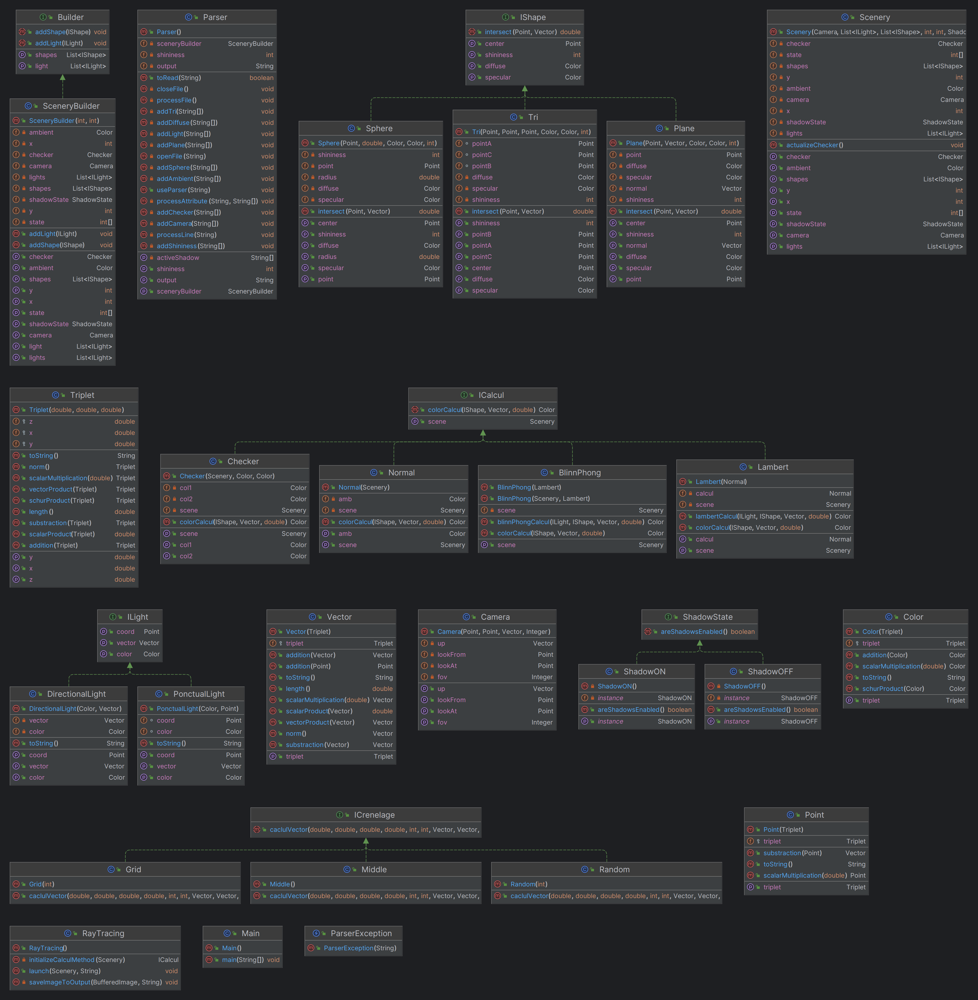

# SAE S3.A.01 - Lanceur de rayon

## Sommaire
- [Membres](#Membres)
- [Diagramme UML](#Diagramme UML)
- [Récapitulatif du projet](#Récapitulatif du projet)
- [Répartition des tâches](#Répartition des tâches)

## Membres

## Diagramme UML

## Récapitulatif du projet

## Répartition des tâches